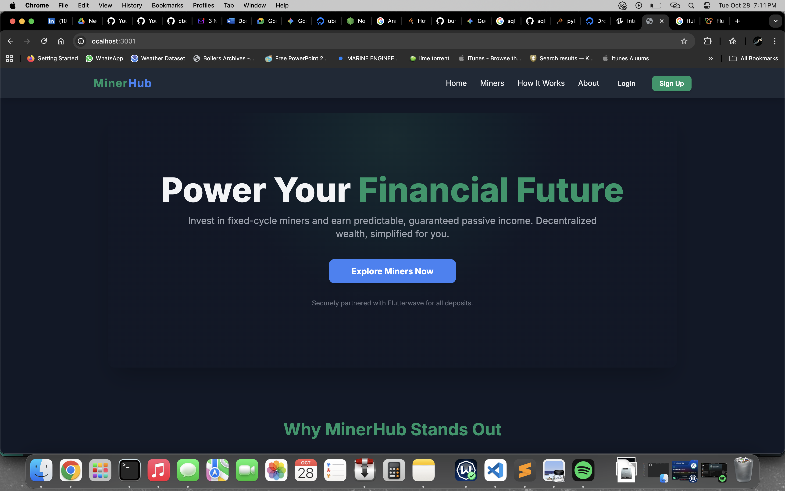
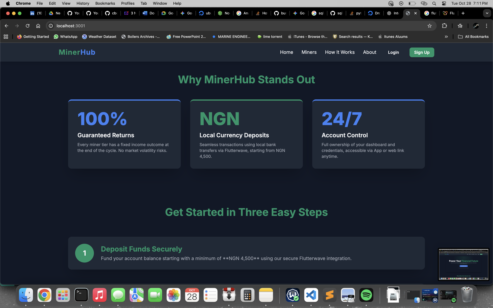
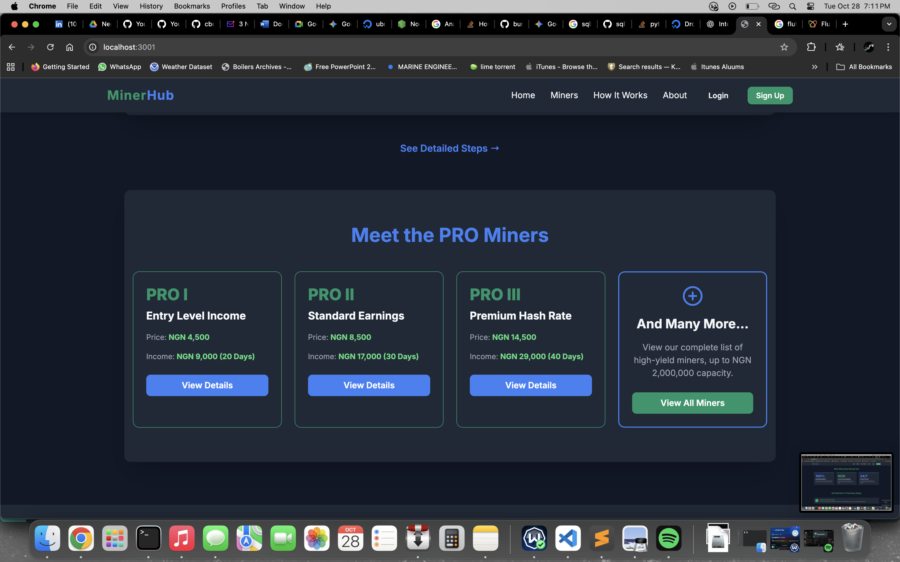
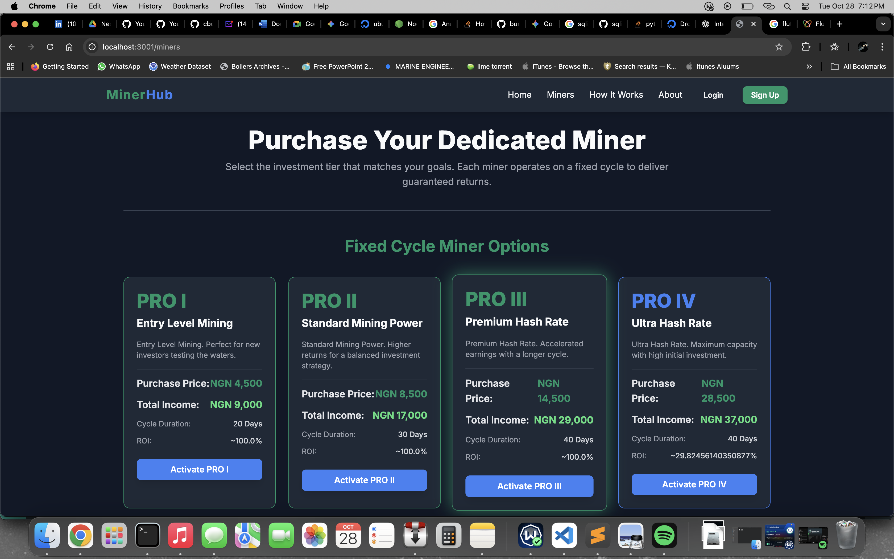
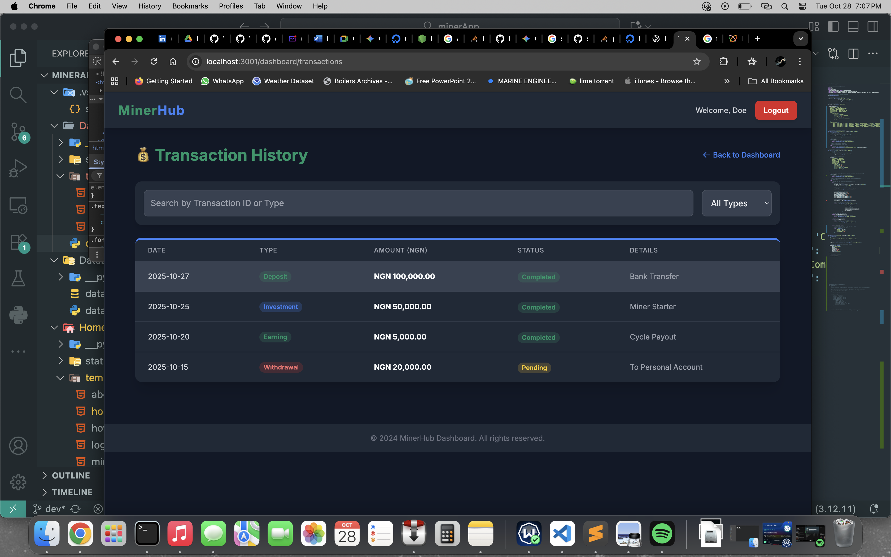

# 💎 MinerHub Investment Platform (Flask Fullstack App)

## 🧩 Overview
This project is a **Fullstack Flask Blueprint Application** that allows users to register, log in, deposit funds via **Flutterwave**, and purchase virtual **miners** that yield returns over defined cycles.  
Authentication is handled via **JWT tokens** (for API security) and **HTTP cookies** (for client session persistence).  

---

## 🚀 Features

### 🔐 Authentication
- User registration and login with password hashing.
- JWT token-based API authentication.
- Cookie-based session management for browser clients.

### 💳 Payment System (Flutterwave Integration)
- Users can **deposit funds** using **Flutterwave** payment gateway.
- Minimum deposit: **₦4,500**
- Maximum deposit: **₦2,000,000**
- Deposit history and wallet balance tracking.

### ⚙️ Miner Purchase System
Users can invest in different **mining plans**, each with a cycle duration and total income.

| Miner Type   | Price (₦) | Total Income (₦) | Duration (Days) |
|---------------|-----------|------------------|-----------------|
| PRO I Miner   | 4,500     | 9,000            | 20              |
| PRO II Miner  | 8,500     | 17,000           | 30              |
| PRO III Miner | 14,500    | 29,000           | 40              |
| PRO IV Miner  | 28,500    | 37,000           | 40              |

💡 Income accrues daily and users can withdraw at the end of the cycle.

---

## 🧱 Tech Stack

### Backend
- **Python Flask**
- **Flask Blueprints** for modular routing
- **Flask-JWT-Extended** for token authentication
- **Flask-CORS** for frontend communication
- **SQLite / MySQL** as database options

### Frontend
- **HTML5 / TailwindCSS / JavaScript**
- Integrated with backend API endpoints
- Uses cookies for session persistence

### Payment Integration
- **Flutterwave API** for handling deposits and transactions.

---

